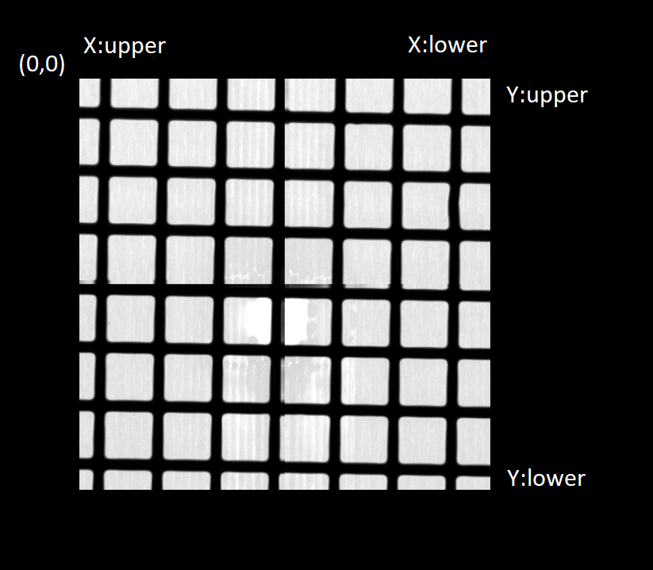
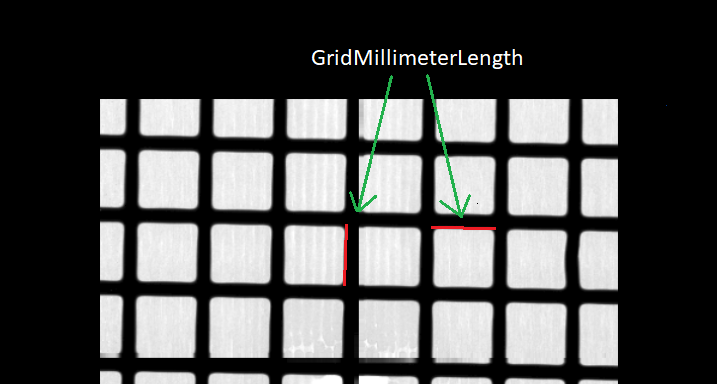
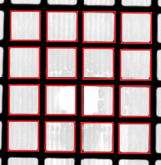
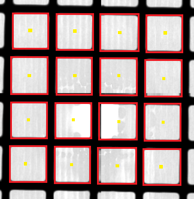
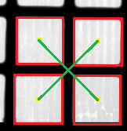
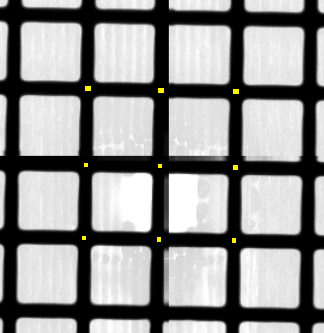
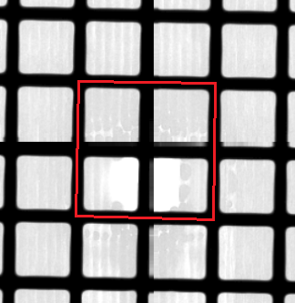
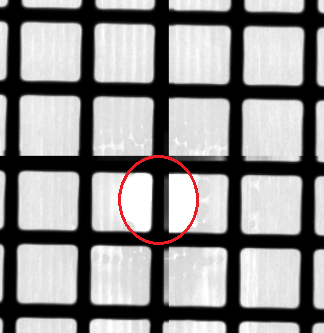

# Getting started
Before you get started download the required packages to run the script.

## Installation
To download the packages required please navigate to the src folder and run the following line in the terminal. 
```bash
pip install -r requirements.txt
```

## Updating documentation
There are a few simple steps to update the documentation files, and if needed the style and naming can be change in the .rst files. The documentation itself is not needed to understand the code. The script is single-threaded and the docstrings in code are the same used in the documentation.

If new folders are added then an empty \__init__.py need to be added too. models folder can be used as reference setup for .py file. Then a sphinx api call is needed to add new .rst files. This call needs to be made from the src folder.     
1. ```
   sphinx-apidoc -o docs .
   ```
The new .rst files can be edited to fit however you like the format to be.

Once changes have been made and the docs need to be updated, run this set of commands in the terminal from the src folder to update the html files.

1. ```
   cd docs
   ```
2. ```
   .\make.bat html
   ```

If the html theme needs to be changed, then it can be done in the `docs/conf.py` file under `html_theme`.

## Settings
You can adjust the scripts settings via a json file called settings.json located in the Detector_Detection folder.

Format of the settings folder:
```bash
{
    "folder" : "../20231207_alignment_grid_offset",
    "type": ".npy",
    "scale": 1.0,
    "showProgress": 0,
    "gridMilliMeterLength": 1.5,
    "singlePixelSizeMilliMeter":0.055
}
```

`folder` is the path to the folder that contains the images that will be used to determine the correction. The path given should be written with src as current folder.
***
`type` is the file type that the images are saved as. If a type or certain specifics, such as file naming, is not implemented then they can be implemented with ImageReader interface.
***
`scale` is the scaling that will be done to the images in the process of finding the DSD (detector-source-distance) with 1.0 being no scaling done. Changing the scaling can give some variance to the results.
***
`showProgress` is boolean type 0 or 1 that indicates whether the scripts should show the images throughout the process or not. 

0: Do not show images. 

1: Show images.
***
`gridMilliMeterLength` is the length of a square on the grid in millimeters.
***
`singlePixelSizeMilliMeter` is the size of the detector pixels in millimeters. 
***

## Nice to know
Here are some things that are nice to know when reading through the code.
The examples will mostly be shown in image.

#### Axis
The script is written with opencv and the defualt placement of origin is the top left corner of a image.


](readmeImages/XandYAxis.png)
***
#### Lower and Upper
Throughout the script upper and lower are mentioned. The use can be ambiguous depending on what part of the script that is being evaluated. The safest way is to run in debug mode and compare upper and lower thresholds to see orientation used. 

When looking at point objects and everything derived from that objects information is done in a specific way. The use of upper and lower was done in respective to the y-axis but not value based. It was done by looking at the image. 

When you look at the bottom of the image and move your eyes up, it was then considered to an upwards movement even though the y-value got smaller because of the origin. In case of x-axis the higher x-values are considered lower movement. The following image shows this case.


***
#### Grid length in mm
The length that this references is that of a single square on the grid.
This same length is found in the script but as pixels instead of mm.



***
#### Translation/Affine matrix
To edit the images in the script a matrix is needed by openCV. Here is a simple description for each index of x and y.

The initial matrix is an eye matrix:
```math
\begin{bmatrix}1&0&0\\0&1&0\end{bmatrix}, \text{  1 is used as default scaling number.}
```
The combinations of x and y:
```math
\begin{bmatrix}0,0\end{bmatrix} \rightarrow \text{Scaling for x, defualt is 1.}
```
```math
\begin{bmatrix}0,1\end{bmatrix} \rightarrow \text{Shearing for y, defualt is 0.}
```
```math
\begin{bmatrix}0,2\end{bmatrix} \rightarrow \text{Translation for x, defualt is 0.}
```
```math
\begin{bmatrix}1,0\end{bmatrix} \rightarrow \text{Shearing for x, defualt is 0.}
```
```math
\begin{bmatrix}1,1\end{bmatrix} \rightarrow \text{Scaling for y, defualt is 1.}
```
```math
\begin{bmatrix}1,2\end{bmatrix} \rightarrow \text{Translation for y, defualt is 0.}
```
Overview with names:
```math
\begin{bmatrix}\text{Scaling X}&\text{Shearing Y}&\text{Translation X}\\\text{Shearing X}&\text{Scaling Y}&\text{Translation Y}\end{bmatrix}
```
***
## Walkthrough of the general steps of the script
Here we will see the general and most important steps of the script in finding the correction to the detector.

#### 1.
First step that happens is reading the images into the script and save as ImageObjects. If more reading methods are needed then add a new .py script in the models folder. The script has to implement the interface ImageReader.py. Afterwards add appropriate element for the new script in the dataObjects/enums/ReaderType.py. 
Lastly register the new file type in the ReaderFactory.py under models. 

#### 2.
Second step is processing the DSD (detector-source-distance) by identifying squares and use them as reference to find other squares.

They are identified by doing bluring, thresholding and finding contours.

This is an example of the process. 



The real contours will match the roundness of the corners of each square.

From here the center point of each square is found.



Each 2x2 pair points form a new kind of square, which has its own class object.
That is because each pair of points is used to cross over the center of the 2x2 as shown on the next image.



This is done for each pair that can be found on the image.

This creates a new set of points that are on the center of each crossover.



If these points meet certain conditions then the script will try to extrapolate them where a 2x2 pair was not possible. This will add new points to the set.

For this example we will not simulate extrapolation.

These points will be used to create a big square around the outermost points.



This big square has a pixel area that fits 4 squares. Here we can find the length of each square that matches the size of "Grid length in mm" section but in pixels instead of mm.

The lowest distance that the image was taken at that usually is 0 mm and is used as a baseline for both distance and length when calculating DSD. 

The process of processing DSD includes finding the magnification and that is added to the ImageObject attribute. This will be used in step 3.

#### 3.
Third step is processing the shift between the images in pixels. This is done through cross correlation between the images to find a common spot between them.

When comparing images to eachother the ones with lower distances will always be more zoomed out then the higher distances. Therefore the lower distance has to be changed to fit the higher distance.

This is done by looking at the magnifications and change the scale of the lower distance image based on the difference of magnification.

The scale needs to occur with a translation of the x and y to center the image again. This is because the scaling move the image without taking the original center into account.

When the images have similiar magnification the calculations of the shift can begin.

The set up for taking the images is a 3D-printed plastic stand. The stand can hold the physical grid with plastic behind, except a small 1 mm hole. This creates a spot where the beam attenuates less than the rest.



On the final image this appears as higher pixel values than the rest. The red circle shows the higher value pixels.

With simple thresholding and some filtering, we can discern this spot from the rest of the image. Since all images have this spot, we can use it as reference to correlate the images.

An initial correlation is done by taking the medians of the spots for x and y. This gives two sets of x and y that describes where the spot is. The difference is used in a translation matrix to fit the lower distance image to the higher distance image.

Lastly for the fine tuned correlation is done by ECC (Enhanced Cross Correlation), that is because the ECC function can not handle large difference in the two images and therefore used for the final bit. This usaully yield about 1-3 pixels in correction.

We end up with sets of matrices that describes the needed translation/shift from one image the the other. 

#### 4.
Final step is taking the shift and turning it into a correction in mm instead of pixels.

We are not 100% sure about this process because it is not tested yet.

The process of converting the shift to mm is done by using `gridMilliMeterLength` and `singlePixelSizeMilliMeter`.

This output shift tells us how much the image has moved in mm from one to the next. That is not enough information, because we need it to tells us how much the detector has shifted off center.

The detector shift is found by considering a triangle from the source to the detector for both x and y to create a vector. The relations between the distances in the images and the DSD and the shift found before is used to calculate the correction shift.

This correction shift will be printed both for mean and median correction.

***
## TODO
* **Correction direction:** The output from the script is in mm for both x and y. The problem is, that they do not tell if it's the actual direction. This can depend on if the image is flip at some point or not. This will need testing, where the directions is applied and evaluated manually to later adjust the output. 


* **Units in CalcShiftMM:** The function used to translate the pixels to millimeter shift might not be correct and needs to be evaluated again.

    The current function to translate pixels to millimeter shift is ```CalcShiftMM```.

    ```python
    def CalcShiftMM(imObj1:ImageObject,imObj2:ImageObject,ShiftMatrix:np.ndarray,maxDistance:float,dsd:float):
        #Translate shift from pixels to mm
        xShift = CalcShiftPX(ShiftMatrix[0,2],imObj1.settings.GRID_MILLIMETER_LENGTH,imObj1.settings.SINGLE_PIXEL_SIZE_MILLIMETER) #Side opposite
        yShift = CalcShiftPX(ShiftMatrix[1,2],imObj1.settings.GRID_MILLIMETER_LENGTH,imObj1.settings.SINGLE_PIXEL_SIZE_MILLIMETER) #Side opposite 

        #Difference in distance
        distance = imObj2.distance - imObj1.distance #Adjacent

        #Use inverse tan to find angle 
        xAngle = np.arctan(xShift/distance)
        yAngle = np.arctan(yShift/distance)

        #Angle should apply to the triangle from the source to detector dsd/distance * x/y shift
        mmShiftX = (dsd/distance) * xShift
        mmShiftY = (dsd/distance) * yShift 

        #mmShiftX = (dsd + imObj1.distance + maxDistance) * np.tan(xAngle)
        #mmShiftY = (dsd + imObj1.distance + maxDistance) * np.tan(yAngle)
        
        # AddSpacePrint()
        # print("print x shift ",np.round(xShift,3))
        # print("print y ",np.round(yShift,3))
        # print("print distance ",np.round(distance,3))
        # print("angle x",np.round(xAngle,3))
        # print("angle y",np.round(yAngle,3))
        # print("mm shift x",np.round(mmShiftX,3))
        # print("mm shift y",np.round(mmShiftY,3))

        return [mmShiftX,mmShiftY] 
    ```
    The last part of the function is where the biggest doubt is as we have tried two approaches to calculate mmShiftX and mmShiftY. The results from both have not been tested completely to know if it's right or not. We have had two sets of images, where they had a known offset between eachother. When the mm shift was calculated for both images, we would take the difference to see how close the difference was to the true value of the offset. 

    The approaches were derived from triangles and the need for the angle and what distances to include is not yet clear. A check-up on the unit calculates of the formula should also be evaluated again.

* **Magnification:** The magnification is used to scale an image onto another image before the shift between them is calculated. The formula looks the following.
    ```python
    magnification = (length * resizedImg.settings.SINGLE_PIXEL_SIZE_MILLIMETER) / resizedImg.settings.GRID_MILLIMETER_LENGTH # +-1
    ```
    It is uncertain whether or not + or - 1 should be included.
    
    The formula consists of 2 constants, that were mentioned in the settings section.

    Therefore the formula usaully looks like the following with numbers.
    ```python
    (length * 0.055) / 1.5
    ```
    Units:
    * ```length``` = [ px ]
    * ```realPixelLength``` = [ mm ]
    * ```gridMillimeterLength``` = [ mm ]

    The formula is used in two different parts and one should be careful if one is changed. The first place is, where all the dsd's is processed because we get the magnification too. The second place is, where the image is scaled down to a reference image and the magnification is calculated to check accuracy but is not used afterwards. 

* **Spelling mistakes** The script comments has some spelling mistakes, weird sentences or bad grammar, that need to be run through and corrected. 

* **Better imagery in readme** The images in this file is done with microsoft paint, which was the only immediate editing tool available and could be done with better tools for more consistent images. 